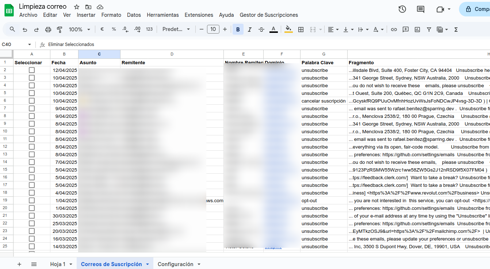
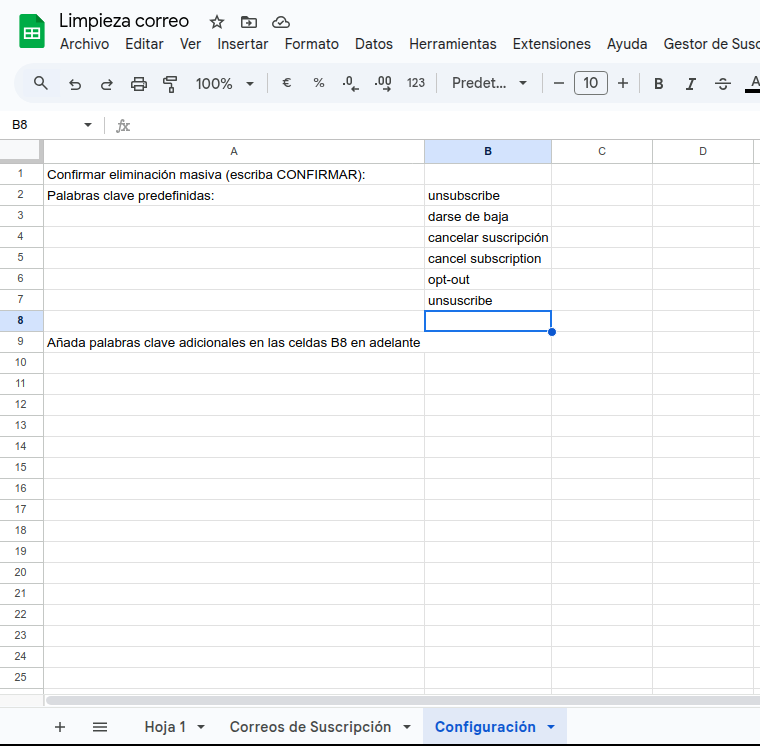

# Limpieza de Correo V.02 - Manual de Usuario

## Descripción General

"Limpieza de Correo V.02" es un script de Google Apps Script diseñado para ayudarte a gestionar y eliminar correos electrónicos no deseados o de suscripción en tu bandeja de Gmail. El script identifica automáticamente correos que contienen palabras clave relacionadas con cancelación de suscripciones, los organiza en una hoja de cálculo de Google Sheets y te permite eliminarlos de forma selectiva o masiva.



## Características Principales

- **Búsqueda inteligente**: Analiza hasta 500 correos (límite de la API de Gmail) buscando palabras clave relacionadas con suscripciones.
- **Palabras clave personalizables**: Incluye palabras predefinidas como "unsubscribe", "darse de baja", etc., y permite añadir tus propias palabras clave.
- **Información detallada**: Extrae fecha, asunto, remitente, dominio y fragmento de texto relevante de cada correo.
- **Selección flexible**: Permite marcar individualmente los correos que deseas eliminar mediante casillas de verificación.
- **Eliminación segura**: Incluye confirmaciones de seguridad para evitar eliminaciones accidentales.
- **Interfaz amigable**: Menú personalizado y botones de acción para facilitar su uso.

## Requisitos Previos

- Cuenta de Google con acceso a Google Sheets y Gmail
- Permisos para ejecutar scripts y acceder a tu correo electrónico

## Instalación

1. **Crear una nueva hoja de cálculo de Google Sheets**:
   - Abre [Google Sheets](https://sheets.google.com)
   - Crea una nueva hoja de cálculo en blanco

2. **Abrir el editor de scripts**:
   - Haz clic en "Extensiones" en el menú superior
   - Selecciona "Apps Script"

3. **Copiar el código**:
   - En el editor de Apps Script, elimina cualquier código existente
   - Copia y pega todo el contenido del archivo `EmailUnsubscribeManager.gs`
   - Haz clic en el icono de guardar (o presiona Ctrl+S) y asigna un nombre al proyecto (por ejemplo, "Limpieza de Correo V.02")

4. **Volver a la hoja de cálculo**:
   - Cierra el editor de Apps Script
   - Actualiza la página de la hoja de cálculo (F5)

## Guía de Uso Paso a Paso

### 1. Iniciar el Script

- Después de instalar el script, verás un nuevo menú llamado "Gestor de Suscripciones" en la barra de menús de tu hoja de cálculo
- Si el menú no aparece automáticamente, actualiza la página (F5)
- La primera vez que utilices cualquier función, Google te pedirá autorizar los permisos necesarios

### 2. Configurar Palabras Clave



- Al ejecutar el script por primera vez, se creará automáticamente una hoja llamada "Configuración"
- Esta hoja contiene palabras clave predefinidas:
  - unsubscribe
  - darse de baja
  - cancelar suscripción
  - cancel subscription
  - opt-out
  - unsuscribe
- **Personalización**: Puedes añadir tus propias palabras clave a partir de la celda B8 en adelante

### 3. Buscar Correos de Suscripción

- Haz clic en "Gestor de Suscripciones" > "Buscar correos de suscripción"
- El script analizará tu bandeja de Gmail (hasta 500 correos) buscando las palabras clave configuradas
- Se creará una hoja llamada "Correos de Suscripción" con los resultados encontrados
- Cada fila contendrá:
  - Una casilla de verificación para seleccionar el correo
  - Fecha de recepción
  - Asunto del correo
  - Dirección de correo del remitente
  - Nombre del remitente (si está disponible)
  - Dominio del remitente
  - Palabra clave encontrada
  - Fragmento de texto donde aparece la palabra clave
  - ID del mensaje (columna oculta)

### 4. Revisar los Resultados

- Examina los correos encontrados en la hoja "Correos de Suscripción"
- Marca las casillas de verificación en la primera columna para los correos que deseas eliminar
- Puedes ordenar o filtrar la tabla para organizar mejor los resultados

### 5. Eliminar Correos Seleccionados

- **Opción 1 - Desde el menú**:
  - Haz clic en "Gestor de Suscripciones" > "Eliminar correos seleccionados"
  
- **Opción 2 - Usando el botón en la hoja**:
  - Desplázate hasta el final de la tabla de resultados
  - Haz clic en la celda amarilla "Eliminar Seleccionados"
  
- Se te pedirá confirmación antes de proceder con la eliminación
- Los correos seleccionados se moverán a la papelera de Gmail
- Después de la eliminación, la lista se actualizará automáticamente

### 6. Eliminar Todos los Correos Listados

- **Paso 1 - Activar la confirmación de seguridad**:
  - Ve a la hoja "Configuración"
  - En la celda B1, escribe exactamente "CONFIRMAR" (sin comillas, respetando mayúsculas)
  
- **Paso 2 - Ejecutar la eliminación**:
  - **Opción 1 - Desde el menú**:
    - Haz clic en "Gestor de Suscripciones" > "Eliminar todos los correos listados"
  
  - **Opción 2 - Usando el botón en la hoja**:
    - Desplázate hasta el final de la tabla de resultados
    - Haz clic en la celda roja "Eliminar Todos"
  
- Se te pedirá una confirmación adicional antes de proceder
- Todos los correos listados se moverán a la papelera de Gmail
- La lista se actualizará automáticamente después de la eliminación

## Solución de Problemas

### El menú "Gestor de Suscripciones" no aparece

- **Solución 1**: Actualiza la página de la hoja de cálculo (F5)
- **Solución 2**: Cierra la hoja y vuelve a abrirla
- **Solución 3**: Verifica que el script se haya guardado correctamente en el editor de Apps Script

### Error al buscar correos

- **Causa posible**: Límite de la API de Gmail (máximo 500 correos)
- **Solución**: El script está configurado para manejar este límite automáticamente. Si persiste el error, intenta ejecutar el script nuevamente.

### No se encuentran correos con las palabras clave

- **Solución 1**: Verifica que las palabras clave estén correctamente configuradas en la hoja "Configuración"
- **Solución 2**: Añade palabras clave adicionales que puedan ser relevantes para tus suscripciones
- **Solución 3**: Asegúrate de que tienes correos con estas palabras clave en tu bandeja de Gmail

### Error de permisos

- **Solución**: Asegúrate de aceptar todos los permisos solicitados por el script
- Si rechazaste los permisos inicialmente, deberás:
  1. Ir a [myaccount.google.com/permissions](https://myaccount.google.com/permissions)
  2. Encontrar y eliminar el acceso del script
  3. Volver a ejecutar el script y aceptar los permisos

## Consideraciones Importantes

- **Seguridad**: Los correos eliminados se mueven a la papelera de Gmail, no se eliminan permanentemente
- **Recuperación**: Puedes recuperar los correos de la papelera de Gmail dentro de los 30 días posteriores a su eliminación
- **Límite**: El script analiza un máximo de 500 correos debido a las limitaciones de la API de Gmail
- **Rendimiento**: El tiempo de ejecución puede variar dependiendo del número de correos analizados

## Personalización Avanzada

Si deseas modificar el comportamiento del script, puedes editar las constantes globales al inicio del código:

```javascript
const CONFIG = {
  MAX_EMAILS: 500,        // Número máximo de correos a analizar (límite de la API de Gmail)
  SHEET_NAME: "Correos de Suscripción", // Nombre de la hoja principal
  CONFIG_SHEET_NAME: "Configuración",   // Nombre de la hoja de configuración
  KEYWORDS_RANGE: "B2:B",  // Rango donde se almacenan las palabras clave personalizadas
  CONFIRM_CELL: "B1",      // Celda para confirmar eliminación masiva
  CONFIRM_TEXT: "CONFIRMAR" // Texto que debe contener la celda para confirmar
};
```

## Actualizaciones y Mejoras Futuras

Este script es la versión 0.2 y puede recibir actualizaciones en el futuro para incluir:
- Análisis de más de 500 correos mediante búsquedas por lotes
- Opciones de filtrado adicionales
- Mejoras en la interfaz de usuario
- Estadísticas sobre los correos de suscripción

## Soporte

Si encuentras algún problema o tienes sugerencias para mejorar el script, puedes:
1. Revisar la documentación de Google Apps Script para entender mejor cómo funciona el código
2. Consultar los registros de ejecución en el editor de Apps Script (Ver > Registros)
3. Contactar al desarrollador para soporte técnico

---

*Desarrollado con Cascade AI - Abril 2025*
